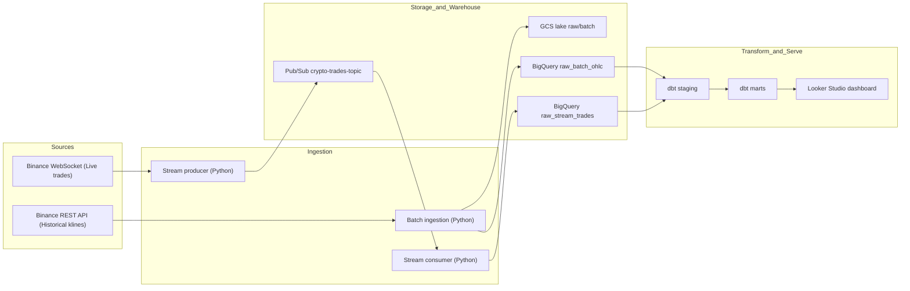
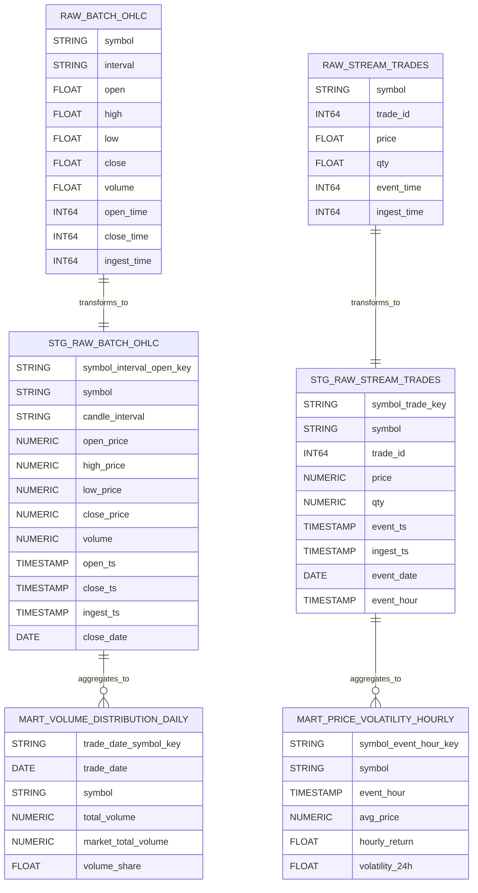

# Crypto Market Reliability and Volatility Pipeline

End-to-end data engineering project for crypto market analytics using batch + stream ingestion, BigQuery, dbt, and a dashboard deliverable.

## Problem Description

Crypto market data is high-volume, event-driven, and changes continuously. Analysts and operators need a reliable way to:

- ingest both historical and live trade data,
- standardize and test data quality before analysis,
- query curated warehouse tables for decision-making,
- visualize symbol-level distribution and time-based trends in a dashboard.

This project solves that by implementing a hybrid data platform on GCP with:

- batch ingestion for historical candles/trades,
- streaming ingestion for near-real-time trades,
- dbt-based transformation/testing layers,
- dashboard-ready marts consumed by Looker Studio.

The business questions addressed include:

- Which symbols contribute most to traded volume over a daily window?
- How does symbol-level price behavior evolve over time at hourly granularity?
- Is the ingestion stack resilient enough to continuously land data to lake and warehouse?

## Architecture Diagram



Implementation paths for each component are listed in the repository structure below.

## Repository Structure

### Folder Descriptions

- `ingestion/` - batch and stream ingestion services.
  - `batch/` - Binance historical extraction, normalization, GCS landing, and BigQuery raw loading.
  - `stream/` - Binance websocket producer and Pub/Sub-to-BigQuery consumer.
- `orchestration/` - Prefect flow definitions for ingestion and transforms.
- `transform/` - dbt project containing staging models, marts, and schema tests.
- `infra/terraform/` - Terraform definitions for GCS, BigQuery datasets, Pub/Sub topic/subscription.
- `dashboard/` - dashboard documentation, URL, and screenshot artifacts.
- `tests/` - automated ingestion tests.
- `submission-docs/` - GitHub-facing shareable design and setup checklist documents.
- `docs/` - local planning/tracking docs (ignored from GitHub).

### Tree View

```text
de-end-to-end-proj/
|-- ingestion/
|   |-- batch/
|   |   `-- binance_batch_ingest.py
|   `-- stream/
|       |-- binance_ws_producer.py
|       `-- pubsub_to_bq_consumer.py
|-- orchestration/
|   `-- prefect_flows.py
|-- transform/
|   |-- dbt_project.yml
|   |-- profiles.yml.example
|   `-- models/
|       |-- staging/
|       |-- marts/
|       `-- schema.yml
|-- infra/
|   `-- terraform/
|       |-- main.tf
|       |-- variables.tf
|       |-- outputs.tf
|       `-- terraform.tfvars.example
|-- dashboard/
|   |-- README.md
|   `-- screenshots/
|-- tests/
|   `-- ingestion/
|-- submission-docs/
|   |-- Crypto Market Reliability & Volatility Dashboard - Design.md
|   |-- GCP Setup Checklist.md
|   `-- Manual Setup Guide - GCP Info and Credentials.md
`-- docs/
    `-- (local planning/tracking docs, gitignored)
```

## Data Model Diagram



## Evaluation Rubric Mapping

- **Problem description**
  - Evidence: `README.md` (Problem Description + Architecture Diagram), `submission-docs/Crypto Market Reliability & Volatility Dashboard - Design.md`
- **Cloud + IaC**
  - Evidence: `infra/terraform/main.tf`, `infra/terraform/variables.tf`, `infra/terraform/outputs.tf`, `infra/terraform/terraform.tfvars.example`
- **Data ingestion (batch + stream)**
  - Evidence: `ingestion/batch/binance_batch_ingest.py`, `ingestion/stream/binance_ws_producer.py`, `ingestion/stream/pubsub_to_bq_consumer.py`, `orchestration/prefect_flows.py`
- **Data warehouse**
  - Evidence: BigQuery raw + analytics datasets provisioned by Terraform, dbt model layers in `transform/models/`
- **Transformations**
  - Evidence: `transform/dbt_project.yml`, `transform/models/staging/`, `transform/models/marts/`, `transform/models/schema.yml`
- **Dashboard**
  - Evidence: `dashboard/README.md`, Looker Studio URL, screenshots in `dashboard/screenshots/`
- **Reproducibility**
  - Evidence: `README.md` (clean clone + golden path), `.env.example`, `Makefile`, `submission-docs/GCP Setup Checklist.md`

## Prerequisites

- Python 3.11+
- GNU Make (`make`)
  - Windows options: Git Bash, Chocolatey (`choco install make`), or WSL
  - If `make` is unavailable, run equivalent Python/pip/dbt commands manually
- Manual GCP setup before first real run:
  - `submission-docs/GCP Setup Checklist.md`

## Clean Clone Walkthrough

### 1) Clone and enter repo
```bash
git clone <repo-url>
cd de-end-to-end-proj
```

### 2) Create virtual environment
- PowerShell:
  - `python -m venv .venv`
- Bash/zsh:
  - `python3 -m venv .venv`

### 3) Activate virtual environment
- PowerShell: `.\.venv\Scripts\Activate.ps1`
- Bash/zsh: `source .venv/bin/activate`

### 4) Install dependencies and project env
- `make setup` *(can also create/refresh `.venv`; running after activation is fine)*
- Copy `.env.example` to `.env` and fill project-specific values.

### 5) Run local-safe checks
- `make lint`
- `make test`

### 6) Reproduce CI dbt parse check (no GCP creds needed)
- Create a parse profile under `.ci/dbt/profiles.yml` (oauth + dummy project/dataset).
- Run:
  - `dbt parse --project-dir transform --profiles-dir .ci/dbt`

### 7) Optional credentialed BigQuery dbt checks
- Copy `transform/profiles.yml.example` to `transform/profiles.yml`.
- Set `GCP_PROJECT_ID` and `GOOGLE_APPLICATION_CREDENTIALS` (path to your service account JSON file).
- Run:
  - `dbt deps --project-dir transform --profiles-dir transform`
  - `dbt test --project-dir transform --profiles-dir transform`

## End-to-End Golden Path

1. **Provision infra (Terraform)**
   - `cd infra/terraform`
   - `terraform init && terraform plan && terraform apply`
   - Manual checkpoint (credentials required): valid GCP auth and project-level permissions.
2. **Run batch ingestion**
   - Back in repo root: `make run-batch`
   - Confirm batch outputs land in configured lake/warehouse targets.
3. **Run stream pipeline in separate terminals**
   - Terminal A: `make run-stream-producer`
   - Terminal B: `make run-stream-consumer`
   - Confirm messages are produced and consumed without sustained errors.
4. **Run dbt transforms/tests**
   - `make dbt-run`
   - `make dbt-test`
   - Manual checkpoint (credentials required): these require configured BigQuery profile/credentials.
5. **Open dashboard artifacts**
   - Dashboard guide: `dashboard/README.md`
   - Evidence folder: `dashboard/screenshots/`
   - Manual checkpoint (review artifact): add shareable dashboard URL + screenshots.

## Command Reference

- Setup: `make setup`
- Lint: `make lint`
- Tests: `make test`
- Batch ingest: `make run-batch`
- Stream producer: `make run-stream-producer`
- Stream consumer: `make run-stream-consumer`
- dbt run: `make dbt-run`
- dbt test: `make dbt-test`

All dbt commands consistently use `--project-dir transform --profiles-dir transform` (or `.ci/dbt` for parse-only CI reproduction).

### Windows

Use **Git Bash**, **WSL**, or **PowerShell** with the `make` targets above. Optional CMD helpers that load `.env` can live in a local `scripts\windows\` folder; that folder is not part of the public repository, so rely on `Makefile` commands for a reproducible path reviewers can follow.

## CI Quality Gate

GitHub Actions workflow: `.github/workflows/ci.yml`
- Always: `make lint`, `make test`, and credential-safe `dbt parse`.
- Conditional: credentialed `dbt deps` + `dbt test` only when GCP secrets exist.

## Reviewer Evidence and Manual Items

- Dashboard implementation guide: `dashboard/README.md`
- Dashboard evidence folder: `dashboard/screenshots/`
- Manual/blocked for reviewer package:
  - Looker Studio share URL (not in repo by design).
  - Final dashboard screenshots in `dashboard/screenshots/`.
  - Credentialed BigQuery-backed `dbt deps`/`dbt test` run proof (requires GCP secrets/credentials).

## Supporting Docs

- Design doc: `submission-docs/Crypto Market Reliability & Volatility Dashboard - Design.md`
- Setup checklist: `submission-docs/GCP Setup Checklist.md`
- Manual GCP setup: `submission-docs/Manual Setup Guide - GCP Info and Credentials.md`
